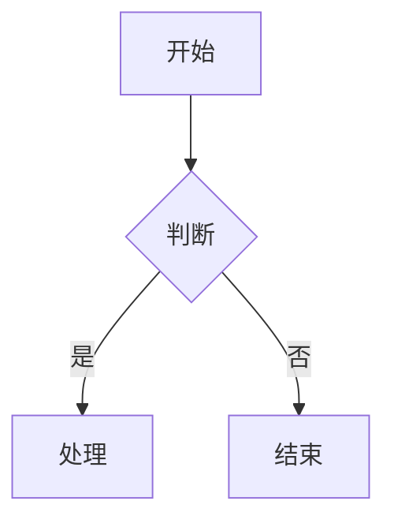

## 1. 标题（Heading）
# H1
## H2
### H3
#### H4
##### H5
###### H6

## 2. 段落与换行
这是一段普通文本。  
这是同一段内的换行（行末两个空格）。  

这是新的段落。

## 3. 强调
*斜体* 或 _斜体_  
**粗体** 或 __粗体__  
***粗斜体*** 或 ___粗斜体___  
~~删除线~~

## 4. 引用
> 一级引用  
>> 二级引用  
>>> 三级引用

## 5. 列表
### 无序列表
- 项目 1
- 项目 2
  - 子项目
    - 子子项目

### 有序列表
1. 第一项
2. 第二项
   1. 子项
   2. 子项

### 任务列表
- [x] 已完成任务
- [ ] 未完成任务

## 6. 代码
### 行内代码
`printf("Hello, Markdown!");`

### 代码块
```python
def hello_world():
    print("Hello, world!")
```

## 7. 分割线
---
***

## 8. 链接与图片
### 链接
[百度](https://www.baidu.com)  
[带标题的链接](https://www.github.com "GitHub")

### 图片


## 9. 表格
| 姓名 | 年龄 | 职业 |
| --- | --- | --- |
| 张三 | 28 | 工程师 |
| 李四 | 24 | 设计师 |

## 10. 脚注
这里有一个脚注[^1]。

[^1]: 这是脚注内容。

## 11. 定义列表
术语 1  
: 定义 1

术语 2  
: 定义 2a  
: 定义 2b

## 12. 上标与下标
H~2~O  
x^2^

## 13. 高亮
==高亮文本==

## 14. Emoji
:smile: :heart: :thumbsup:

## 15. 注释
<!-- 这是注释，不会显示 -->

## 16. 数学公式（KaTeX）
### 行内公式
公式 $a^2 + b^2 = c^2$ 是勾股定理。

### 块级公式
$$
\int_{-\infty}^{\infty} e^{-x^2} dx = \sqrt{\pi}
$$

## 17. Mermaid 流程图


## 18. 折叠内容
<details>
  <summary>点击展开</summary>
  这里是折叠内容。
</details>

## 19. 自定义容器
::: tip
这是提示信息
:::

::: warning
这是警告信息
:::

::: danger
这是危险信息
:::